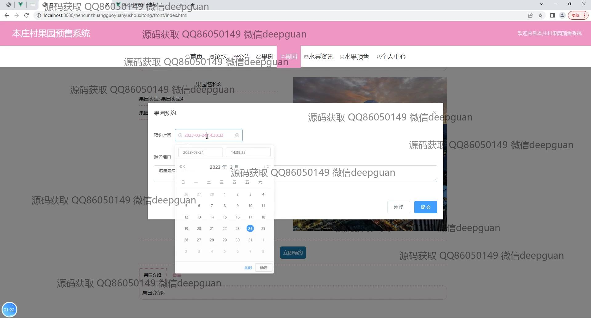

<h1 align="center">本庄村果园预售系统的设计与实现</h1>

## 简介
本庄村果园预售系统：角色分为管理员、用户；用户浏览果品、下单预售和留言功能；管理员管理订单、果园信息和用户反馈；系统支持注册登录、购物车、订单管理等多种功能，提升用户体验和销售效率。    --计算机毕业设计源码；毕设源码；java毕业设计源码

## 联系方式

<h3 align="center">获取完整代码与数据库文件 + 微信：deepguan QQ: 86050149 QQ群: 783742310</h3>

<h3 align="center">可帮忙远程部署 包运行成功！提供远程部署、修改代码、设计文档指导、代码讲解等服务！</h3>

## 功能介绍（完整见运行截图）
管理员：管理员可以进行用户注册、登录及信息管理，同时负责果园、果树及商品的管理操作，包括添加、删除、修改和查看等功能。他们也可以监控预售订单的状态，管理公告信息，处理用户反馈和审核用户留言。后台提供详细的订单管理功能，包括查看详情、修改状态及确认发货等操作，以确保预售系统的顺畅运行和用户体验的提升。

用户：用户可以通过系统进行账户注册和登录，浏览果园及果树的详细信息。网站提供水果及果树的预售信息展示，用户可选择感兴趣的产品，查看详情及价格，进行预购和下单操作。个人中心功能允许用户管理个人信息、查看订单状态、修改收货地址以及管理收藏夹。系统也支持订单搜索、查看详情、管理和取消等功能，简化用户的购买流程和保障操作的便捷性。

## 运行截图

本代码来源于网络,仅供学习参考使用!

